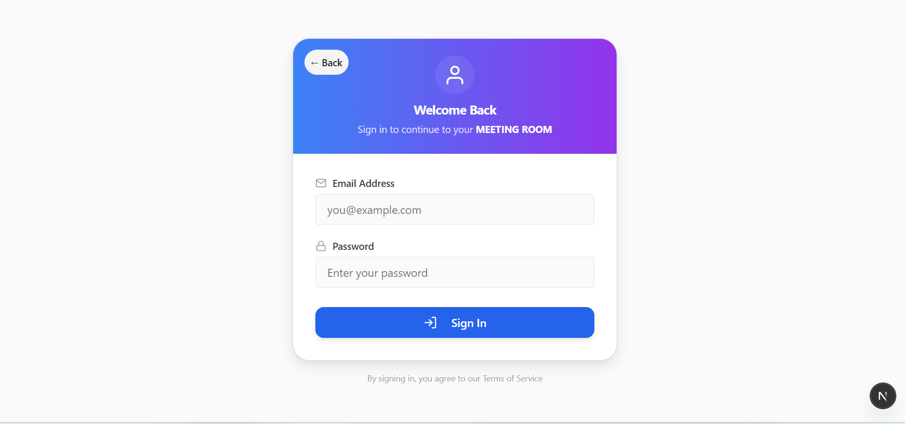
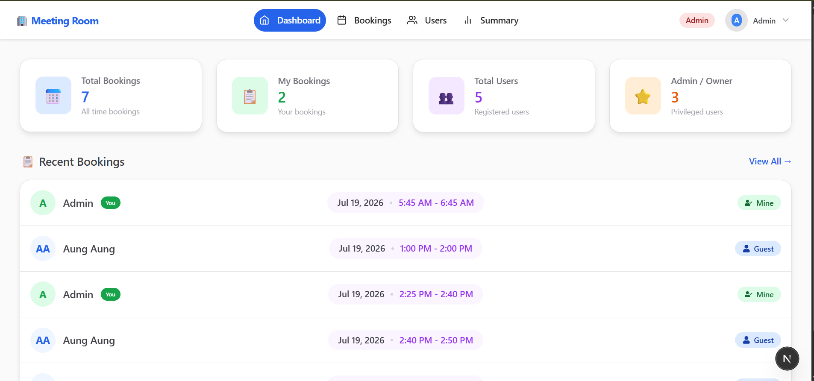
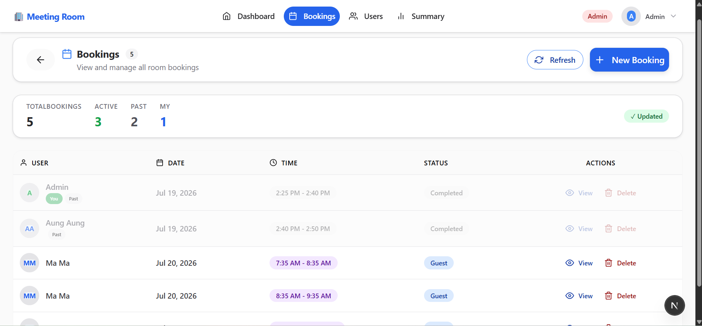
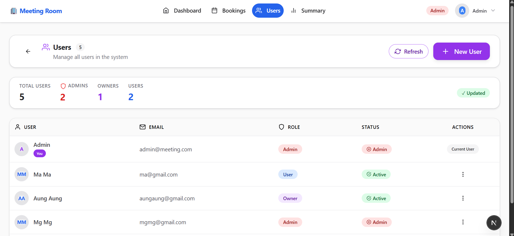
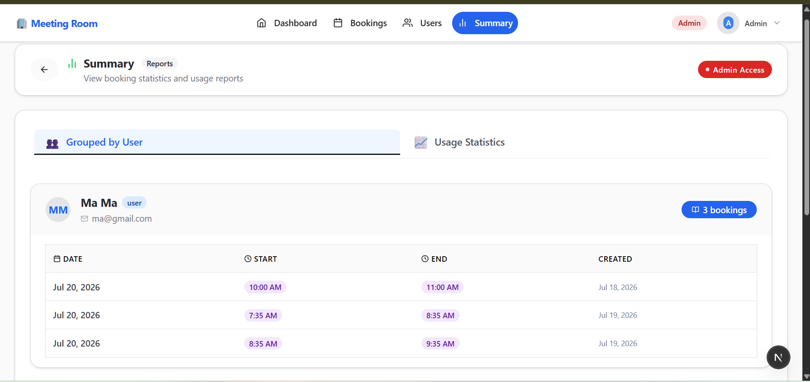
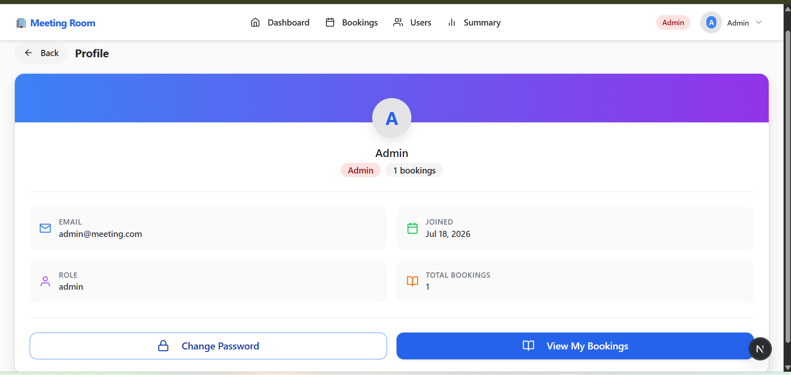

# 🏢 Meeting Room Booking System

A full-stack web application for managing bookings for a single meeting room, featuring role-based access control for Admins, Owners, and regular Users.

---

## 🚀 Live Demo

The application is deployed and accessible at the following link:

```
https://meeting-room-booking-system.vercel.app/
```

---

## 📋 Booking Rules

The system enforces the following booking rules:

- ✅ `startTime` must be earlier than `endTime`.
- ✅ Bookings must not overlap with existing bookings.
- ✅ The system correctly detects:
    - Identical booking ranges
    - Partial overlaps
    - One booking completely inside another
- ✅ Back-to-back bookings are **allowed**.
- ✅ All date and time values are stored and processed in **UTC**.
- ✅ Invalid booking requests return meaningful error messages.

---

## ✨ Features

### 🔐 Authentication & Authorization
- Secure login and registration
- Role-based access control (Admin, Owner, User)
- Persistent login via HTTP-only cookies

### 📅 Booking Management
- Create new bookings
- View all bookings in a list
- Delete bookings (users can delete their own; owners/admins can delete any)

### 👥 Administration (Admin Only)
- View a list of all users
- Create new users
- Change user roles (e.g., from User to Owner)
- Delete users (cascades to remove their bookings)

### 📊 Owner & Admin Dashboard
- View bookings grouped by user
- View a basic usage summary (e.g., total bookings per user)
- Access to a dedicated summary page with statistics

### 👤 User Profile
- View and manage personal profile information
- Change password functionality

---

## 📝 System Assumptions

To simplify the implementation, the following assumptions were made:

- This application manages **only one meeting room**.
- Time is stored and compared using **UTC**.
- Back-to-back bookings are allowed.
- A user must be logged in before creating a booking.
- When an Admin deletes a user, **all bookings created by that user are also deleted**.
- Authentication is simplified for assignment purposes and is not production-grade.


---
## 🛠️ Tech Stack

### Frontend

```
┌─────────────────────────────────────────────────────────┐
│  Next.js  │  TypeScript   │  Chakra UI  │ Redux Toolkit │
│  React Hook Form  │  Zod  │  RTK Query                  │
└─────────────────────────────────────────────────────────┘
```

### Backend

```
┌─────────────────────────────────────────────┐
│  Node.js  │  Express.js    │  MongoDB       │
│  Mongoose │  JWT           │  bcryptjs      │
└─────────────────────────────────────────────┘
```

---

## 📁 Project Structure

```
Meeting-Room-Booking-System/
├── backend/          # Node.js + Express API
│   ├── src/
│   │   ├── models/       # Database models
│   │   ├── controllers/  # Request handlers
│   │   ├── routes/       # API routes
│   │   ├── services/     # Business logic
│   │   ├── middleware/   # Auth, validation
│   │   └── utils/        # Helpers, JWT, error handling
│   ├── server.js         # Application entry point
│   └── package.json
│
└── frontend/         # Next.js application
    ├── src/
    │   ├── app/           # Next.js App Router (pages)
    │   ├── components/    # Reusable UI components
    │   ├── lib/           # API, store, types, schemas
    │   └── utils/         # Helper functions
    ├── public/            # Static assets
    ├── .env.local         # Environment variables
    └── package.json
```

---

## 🚦 Getting Started

### Prerequisites

```
Node.js (v18 or later)
pnpm (preferred) or npm
MongoDB (local or Atlas)
```

### Installation

**1. Clone the repository**

```bash
git clone https://github.com/KyawZayYa-c/Meeting-Room-Booking-System.git
cd Meeting-Room-Booking-System
```

**2. Setup Backend**

```bash
cd backend
pnpm install
```

Create a `.env` file in the `backend` directory:

```env
PORT=5000
MONGODB_URI=your_mongodb_connection_string
JWT_SECRET=your_super_secret_key
CLIENT_URL=http://localhost:3000
NODE_ENV=development
```

> **Note:** An admin user is automatically seeded when the server starts:
> - **Email:** `admin@meeting.com`
> - **Password:** `admin123`

**3. Setup Frontend**

```bash
cd ../frontend
pnpm install
```

Create a `.env.local` file in the `frontend` directory:

```env
NEXT_PUBLIC_API_URL=http://localhost:5000/api
```

### Running the Application

**Start Backend Server**

```bash
cd backend
pnpm run dev
```

Server running at: `http://localhost:5000`

**Start Frontend Development Server**

```bash
cd frontend
pnpm run dev
```

Application running at: `http://localhost:3000`

---

## 📸 Screenshots

| Login Page | Dashboard | Bookings |
|------------|-----------|----------|
|  |  |  |

| Admin Users | Summary | Profile |
|-------------|---------|---------|
|  |  |  |

---

## 🔧 API Endpoints

| Method | Endpoint | Description | Access |
|--------|----------|-------------|--------|
| `POST` | `/api/auth/login` | User login | Public |
| `POST` | `/api/auth/logout` | User logout | Authenticated |
| `GET` | `/api/auth/me` | Get current user | Authenticated |
| `GET` | `/api/bookings` | Get all bookings | Authenticated |
| `POST` | `/api/bookings` | Create booking | Authenticated |
| `DELETE` | `/api/bookings/:id` | Delete booking | User(own)/Owner/Admin |
| `GET` | `/api/users` | Get all users | Admin only |
| `POST` | `/api/users` | Create user | Admin only |
| `PUT` | `/api/users/:id/role` | Change user role | Admin only |
| `DELETE` | `/api/users/:id` | Delete user | Admin only |
| `GET` | `/api/summary/grouped` | Grouped bookings | Owner/Admin |
| `GET` | `/api/summary/usage` | Usage summary | Owner/Admin |

---

## 🤝 Contributing

As this is a project assignment, contributions are not being accepted at this time. However, feel free to fork the repository for your own learning purposes.

---

## 📜 License

This project is open-source and available under the **MIT License**. See the [LICENSE](LICENSE) file for more details.

---

### 🧪 Demo Accounts

| Role      | Email              | Password |
|-----------|--------------------|----------|
| **Admin** | admin@meeting.com  | admin123 |
| **Owner** | owner@meeting.com  | owner123 |
| **User**  | user@meeting.com   | user123  |

## 👨‍💻 Author

**Kyaw Zay Ya**

- GitHub: [@KyawZayYa-c](https://github.com/KyawZayYa-c)
- Project Link: [https://github.com/KyawZayYa-c/Meeting-Room-Booking-System](https://github.com/KyawZayYa-c/Meeting-Room-Booking-System)
- [x] Demo WebApp Link: [[https://meeting-room-booking-system.vercel.app/](https://meeting-room-booking-system.vercel.app/)]
---

<div align="center">
  Made with ❤️ by Kyaw Zay Ya
</div>